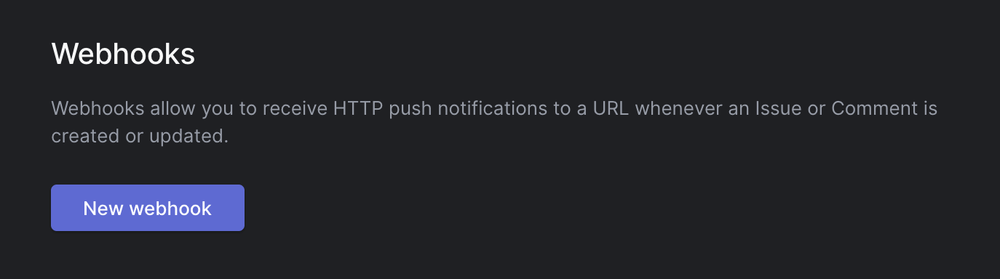
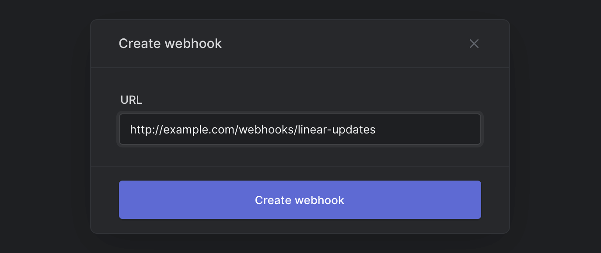

> ⚠️ Visit our [API docs site](https://developers.linear.app/docs/graphql/webhooks) for the most up to date documentation

# Linear Webhooks

Linear provides **webhooks** which allow you to receive HTTP push notifications whenever data is created or updated. This allows you to build integrations on top of Linear. You could trigger CI builds, perform calculations on issue data, or send messages on specific conditions – you name it.

Webhooks are specific to a `Team`, so you can configure webhooks to satisfy the needs of each team in your organization. Webhook updates are currently supported for following models:

- `**Issue**`
- `**Comments**`
- `**Reaction**` (comment emoji reactions)

## How does a Webhook work?

A webhook push is simply a `HTTP POST` request, sent to the URL of your choosing. The push is automatically triggered by Linear when data updates. For an example of what data a payload contains, see [The Webhook Payload](#the-webhook-payload).

Your webhook consumer is a simple HTTP endpoint. It must satisfy the following conditions:

- It's available in a publicly accessible HTTPS, non-localhost URL
- It will respond to the Linear Webhook push (HTTP POST request) with a `HTTP 200` ("OK") response

If a delivery fails (i.e. server unavailable or responded with a non-200 HTTP status code), the push will be retried a couple of times. Here an exponential backoff delay is used: the attempt will be retried after approximately 10 minutes, then 30 minutes, and so on. If the webhook URL continues to be unresponsive the webhook might be disabled by Linear, and must be re-enabled again manually.

For additional information on Webhooks, there are a number of good resources:

- [RequestBin: Webhooks – The Definitive Guide](https://requestbin.com/blog/working-with-webhooks/)
- [requestbin.com](https://requestbin.com/) is a great tool for testing webhooks
- [GitHub Developer Guide: Webhooks](https://developer.github.com/webhooks/)

## Getting started with Linear Webhooks

You will first need to create a Webhook endpoint (_"consumer"_) to be called by the Linear Webhook agent. This can be a simple HTTP server you deploy yourself, or a URL endpoint configured by a service such as [Zapier](https://zapier.com/) (or for testing purposes, [RequestBin](https://requestbin.com/)).

Once your consumer is ready to receive updates, you can enable it for your Linear team. Webhooks can be enabled in Linear both via the Team Settings UI.

### Creating a simple Webhook consumer

You might consider using something like Netlify Functions, which provides a straightforward way of deploying simple HTTP(S) endpoints: https://www.netlify.com/blog/2018/09/13/how-to-run-express.js-apps-with-netlify-functions/.

Keeping the requirements in mind, a simple but workable Node.js/Express (v4) webhook consumer might look something like this:

```js
const express = require("express");
const bodyParser = require("body-parser");
const app = express();
const port = 3000;

// Parse the request body
app.use(bodyParser.json());

// Receive HTTP POST requests
app.post("/my-linear-webhook", (req, res) => {
  const payload = req.body;
  const { action, data, type, createdAt } = payload;

  // Do something neat with the data received!

  // Finally, respond with a HTTP 200 to signal all good
  res.sendStatus(200);
});

app.listen(port, () => console.log(`My webhook consumer listening on port ${port}!`));
```

### Configuring with the Settings UI

The easiest way to configure a Webhook is via Team Settings. Open Settings, choose your Team and find "Webhooks".



Click on "New webhook", and specify the URL in which you have an endpoint ready to receive HTTP POST requests.



Your newly created webhook will be listed and is ready to be used. Your defined URL of `http://example.com/webhooks/linear-updates` will now get notified of any updates on Issues and Comments.

### Configuring via GraphQL API

Refer to the [Linear GraphQL API](API.md) documentation for information on the endpoint and authentication.

Once you've created an API token and found out the `teamId` that will own the Webhook, you're ready to get going.

#### Creating a new Webhook

To create a new Webhook via the API, you can create a new Webhook with by calling a `webhookCreate` mutation with the `teamId` and `url` of your webhook, and the preferred `resourceTypes` (`[Comment, Issue, IssueLabel, Project, Cycle, Reaction]`):

```
mutation {
  webhookCreate(
    input: {
      url: "http://example.com/webhooks/linear-consumer"
      teamId: "72b2a2dc-6f4f-4423-9d34-24b5bd10634a"
      resourceTypes: ["Issue"]
    }
  ) {
    success
    webhook {
      id
      enabled
    }
  }
}
```

The server should respond with a `success` flag, along the `id` of your newly created webhook:

```json
{
  "data": {
    "webhookCreate": {
      "success": true,
      "webhook": {
        "id": "790ce3f6-ea44-473d-bbd9-f3c73dc745a9",
        "enabled": true
      }
    }
  }
}
```

That's it! Your webhook is now ready to use and enabled by default. You can try it out e.g. by commenting on an Issue on your team, or maybe creating a new Issue.

#### Querying existing webhooks

Your webhooks belong to a Team. You can either query all webhooks in your organization, or find them via their respective teams.

Querying all webhooks in your organization (the results are paginated, so you will need to include the `nodes` property.):

```
query {
  webhooks {
    nodes {
      id
      url
      enabled
      team {
        id
        name
      }
    }
  }
}
```

Querying webhooks via their associated teams:

```
query {
  teams {
    nodes {
      webhooks {
        nodes {
          id
          url
          enabled
          creator {
            name
          }
        }
      }
    }
  }
}
```

#### Deleting a webhook

Deleting a webhook is done with the `webhookArchive` mutation, by supplying the `id` of the webhook in question. Despite its name, the webhook will be deleted for good:

```
mutation {
  webhookArchive(
    id: "1087f03a-180a-4c31-b7dc-03dbe761ff59"
  ) {
    success
  }
}
```

## The Webhook Payload

The webhook HTTP payload will include information both in its HTTP headers and its request body.

The format of the payload body reflects that of the corresponding GraphQL entity. To get a hang of the data contained in the various objects, feel free to play around with GraphQL queries against Linear's API.

The payload will be sent with the following HTTP headers:

```http
Accept-Charset: utf-8
Content-Type: application/json; charset=utf-8
Linear-Delivery: 234d1a4e-b617-4388-90fe-adc3633d6b72
Linear-Event: Issue
User-Agent: Linear-Webhook
```

Where the custom headers include:

| Name              | Description                                                       |
| ----------------- | ----------------------------------------------------------------- |
| `Linear-Delivery` | An UUID (v4) uniquely identifying this payload.                   |
| `Linear-Event`    | The Entity type which triggered this event: `Issue`, `Comment` etc |

The Payload body has the following structure:

| Field         | Description                                                                               |
| ------------- | ----------------------------------------------------------------------------------------- |
| `action`      | The type of the action that took place: `create`, `update` or `remove`.                   |
| `type`        | The type of entity that was targeted by the action.                                       |
| `createdAt`   | The date and time that the action took place.                                             |
| `data`        | The serialized value of the subject entity.                                               |
| `url`         | URL where you can open up the subject entity.                                             |
| `updatedFrom` | For `update` actions, an object containing the previous values of all updated properties. |

For example:

```json
{
  "action": "create",
  "data": {
    "id": "2174add1-f7c8-44e3-bbf3-2d60b5ea8bc9",
    "createdAt": "2020-01-23T12:53:18.084Z",
    "updatedAt": "2020-01-23T12:53:18.084Z",
    "archivedAt": null,
    "body": "Indeed, I think this is definitely an improvement over the previous version.",
    "edited": false,
    "issueId": "539068e2-ae88-4d09-bd75-22eb4a59612f",
    "userId": "aacdca22-6266-4c0a-ab3c-8fa70a26765c"
  },
  "type": "Comment",
  "url": "https://linear.app/issue/LIN-1778/foo-bar#comment-77217de3-fb52-4dad-bb9a-b356beb93de8",
  "createdAt": "2020-01-23T12:53:18.084Z"
}
```
